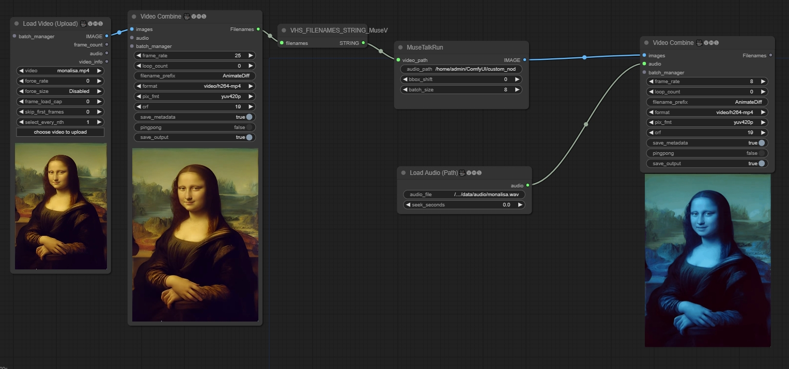

# ComfyUI-MuseTalk

## workflow

https://github.com/chaojie/ComfyUI-MuseTalk/blob/main/wf.json



## Installation

### Build environment

```shell
pip install -r requirements.txt
```

### mmlab packages
```bash
pip install --no-cache-dir -U openmim 
mim install mmengine 
mim install "mmcv>=2.0.1" 
mim install "mmdet>=3.1.0" 
mim install "mmpose>=1.1.0" 
```

### Download weights
You can download weights manually as follows:

1. Download our trained [weights](https://huggingface.co/TMElyralab/MuseTalk).

2. Download the weights of other components:
   - [sd-vae-ft-mse](https://huggingface.co/stabilityai/sd-vae-ft-mse)
   - [whisper](https://openaipublic.azureedge.net/main/whisper/models/65147644a518d12f04e32d6f3b26facc3f8dd46e5390956a9424a650c0ce22b9/tiny.pt)
   - [dwpose](https://huggingface.co/yzd-v/DWPose/tree/main)
   - [face-parse-bisent](https://github.com/zllrunning/face-parsing.PyTorch)
   - [resnet18](https://download.pytorch.org/models/resnet18-5c106cde.pth)


Finally, these weights should be organized in `models` as follows:
```
ComfyUI/models/diffusers/TMElyralab/MuseTalk/
├── musetalk
│   └── musetalk.json
│   └── pytorch_model.bin
├── dwpose
│   └── dw-ll_ucoco_384.pth
├── face-parse-bisent
│   ├── 79999_iter.pth
│   └── resnet18-5c106cde.pth
├── sd-vae-ft-mse
│   ├── config.json
│   └── diffusion_pytorch_model.bin
└── whisper
    └── tiny.pt
```

